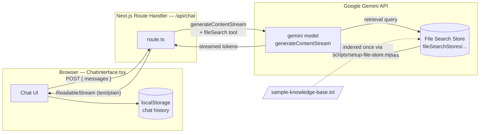
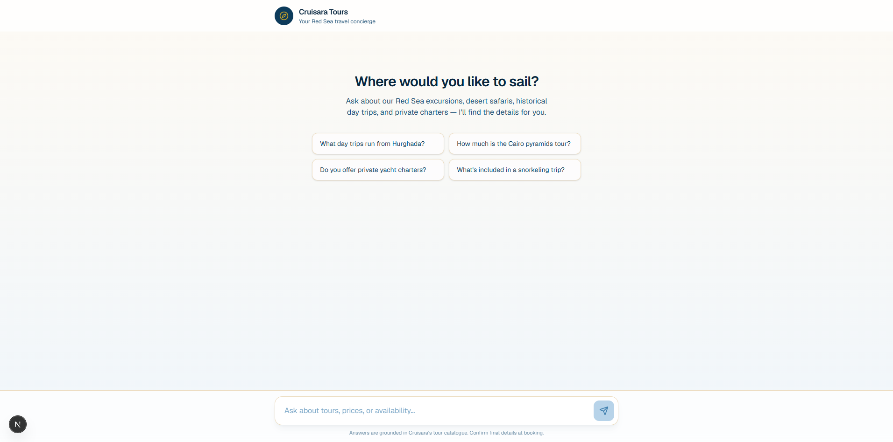
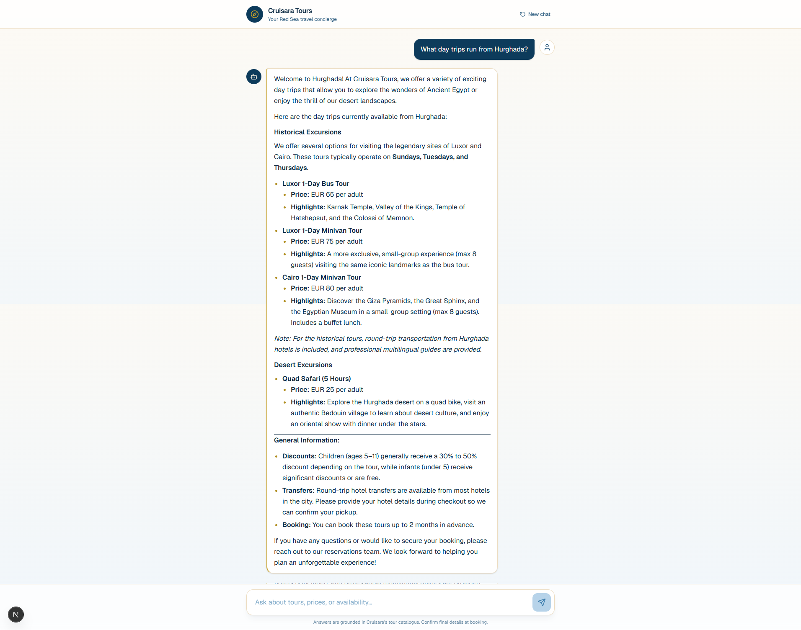

# Cruisara RAG Assistant

An AI travel concierge for **Cruisara Tours**, a Red Sea travel agency based in Hurghada, Egypt. The assistant answers guest questions about tours, pricing, schedules, and booking policies with streamed, markdown-formatted responses that are grounded in the agency's own knowledge base via Retrieval-Augmented Generation (RAG) — never guessed, never hallucinated.

## Features

- **Grounded answers, not guesses** — every factual claim (price, duration, inclusion) is retrieved from the indexed knowledge base through the Gemini File Search tool before the model responds.
- **Real-time streaming** — responses render token-by-token via the Web Streams API, no client-side polling.
- **Markdown-aware chat UI** — bullet lists, bold text, and links render properly through `react-markdown` + `remark-gfm`.
- **Conversation persistence** — chat history survives a page reload via `localStorage`.
- **Luxury, responsive design** — a deep-ocean-blue and sand/gold theme built on Tailwind CSS v4, usable from mobile to desktop.
- **Typing indicator** — a visible "the concierge is thinking" state while the first token is in flight.

## Tech Stack

| Layer | Technology |
|---|---|
| Framework | [Next.js 16](https://nextjs.org/) (App Router) |
| UI | [React 19](https://react.dev/), [Tailwind CSS v4](https://tailwindcss.com/) |
| Language | TypeScript |
| AI SDK | [`@google/genai`](https://www.npmjs.com/package/@google/genai) |
| Model | Gemini (configurable — see [Choosing a model](#choosing-a-model)) |
| Retrieval | Gemini File Search Store (managed RAG index) |
| Markdown | `react-markdown`, `remark-gfm` |
| Icons | `lucide-react` |

## Architecture



**Request flow:**
1. The user submits a message; the full conversation history is POSTed to `app/api/chat/route.ts`.
2. The route calls `ai.models.generateContentStream` with the Gemini File Search tool attached, pointing at the pre-built File Search Store.
3. Gemini retrieves relevant chunks from the indexed knowledge base, grounds its answer in them, and streams the response back token-by-token.
4. The route re-streams those tokens to the browser as a raw `text/plain` body.
5. The client reads the stream chunk-by-chunk, appending each piece to the assistant's message for a live typewriter effect, then renders the finished text as markdown.

## Prerequisites

- **Node.js 20.6+** (for native `--env-file` support used by the setup script)
- A **Google AI Studio API key** — [aistudio.google.com/apikey](https://aistudio.google.com/apikey)
- A knowledge base text file. `knowledge-base/sample-knowledge-base.txt` ships with the repo and works out of the box.

## Getting Started

### 1. Install dependencies

```bash
npm install
```

### 2. Configure environment variables

Copy the example file:

```bash
cp .env.example .env.local
```

Fill in `.env.local`:

```bash
# Google Gen AI API key — https://aistudio.google.com/apikey
GEMINI_API_KEY=your_api_key_here

# Full resource name of the File Search Store holding your knowledge base
# Format: fileSearchStores/<store-id>  (NOT the /documents/... path)
GEMINI_FILE_STORE_NAME=
```

### 3. Create and index the File Search Store

This project ships a one-time setup script that creates a Gemini File Search Store, uploads the knowledge base file, and waits for indexing to finish:

```bash
npm run setup:store
```

By default this indexes the bundled demo data at `knowledge-base/sample-knowledge-base.txt`. To index your own knowledge base instead, point `KNOWLEDGE_BASE_FILE` at a file kept outside the repository:

```bash
KNOWLEDGE_BASE_FILE=../private/my-knowledge-base.txt npm run setup:store
```

The script prints a line like:

```
GEMINI_FILE_STORE_NAME=fileSearchStores/travel-assistant-knowledge-base-xxxxxxxxxxxx
```

Copy that **exact** value into `.env.local`. Do not use a path that includes `/documents/...` — that identifies a single indexed document, not the store itself, and requests will fail with `FileSearchStore name does not match expected format`.

### 4. Run the development server

```bash
npm run dev
```

Open [http://localhost:3000](http://localhost:3000).

## Choosing a Model

The model is set in a single constant in `app/api/chat/route.ts`:

```ts
const MODEL = "gemini-3.1-flash-lite";
```

Swap this for any Gemini model that supports the File Search tool (e.g. `gemini-2.5-flash`) depending on your latency, cost, and quota needs. If you're on a free-tier API key and hit `429` (rate limit / quota exhausted) errors under normal use, switching to a `-lite` variant is the fastest fix — see [ARCHITECTURE_NOTES.md](./ARCHITECTURE_NOTES.md) for the full story.

## Project Structure

```
app/
├── api/chat/route.ts        # Streaming RAG endpoint
├── components/
│   ├── ChatShell.tsx         # Client-only wrapper (avoids hydration mismatch)
│   ├── ChatInterface.tsx     # State, streaming reader, localStorage persistence
│   ├── ChatInput.tsx         # Auto-growing textarea + send button
│   ├── MessageBubble.tsx     # User/AI bubbles, markdown rendering
│   └── TypingIndicator.tsx   # Animated "thinking" indicator
├── lib/types.ts              # Shared ChatMessage type
├── globals.css               # Tailwind v4 theme tokens (ocean/sand/gold)
├── layout.tsx
└── page.tsx
scripts/
└── setup-file-store.mjs      # One-time File Search Store creation + indexing
knowledge-base/
└── sample-knowledge-base.txt # Demo knowledge base (fictional data)
```

## Knowledge Base & Data Privacy

The original production knowledge base is **not** included in this repository. A sample dataset is provided for demonstration purposes.

`knowledge-base/sample-knowledge-base.txt` contains fictional tours, prices, and policies that mirror the real schema, so the RAG pipeline can be run end to end without publishing any client's operational data. Every phone number, email address, and price in it is made up.

To run against real data, keep the file outside the repository (or anywhere matched by `.gitignore`) and pass it explicitly:

```bash
KNOWLEDGE_BASE_FILE=../private/my-knowledge-base.txt npm run setup:store
```

Client knowledge bases typically aggregate contact details, pricing, and booking policies into a single file. Even where each fact is individually public, collecting it all in a public repository makes bulk reuse trivial — so it stays out of version control.

## Screenshots

| Welcome screen | Grounded answer with sources |
|---|---|
|  |  |

## License

Private project — no license granted for reuse.
